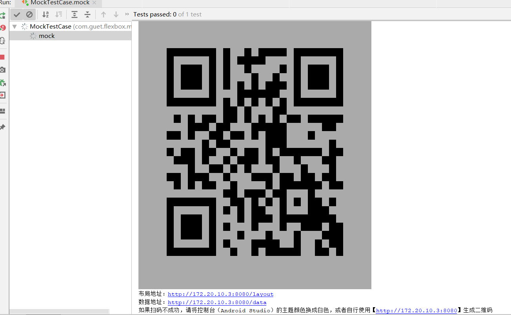

## 1 前言
前段时间刚从美团实习返校，手头上堆了一堆事情要忙，人直接傻掉了，学校搞工程专业认证的时候总能给你整点新花样，加之后面冬季寒冷，自己不小心又瘟了一段时间，导致一直没有产出文章，现在重感冒刚刚好，恰好自己这段时间也学了一点是有关IDEA插件开发的相关知识，在这里分享给大家。

**PS**：本着kotlin first的原则，本文大部分时候使用的是kotlin，并且openapi中很大一部分也已经是kotlin编写的了。

## 2 IntelliJ插件是什么？
这么说吧，不管是IDEA也好还是咱用的Android Studio也好，其实都是基于Jetbrains IntelliJ平台的软件。而Android Studio本质上也就是IDEA+Android Gradle Plugin+IDEA Android Plugin罢了。

编写插件总的来说还是为了方便我们程序员自己的，当我们需要IDEA为我们支持更多的语言或者集成更多的开发环境的时候，就需要借助IntelliJ平台的openapi来开发插件。

当然我也不是无缘无故地去学习插件开发，我为[Gbox](https://github.com/sanyuankexie/Gbox)开发了IDEA（Android Studio）的DSL插件支持插件[handshake](https://github.com/sanyuankexie/handshake)，本文也主要围绕handshake的几个主要功能来对插件开发进行介绍，本文至少能带你实现以下功能（包括但不限于，因为修改Psi那部分可发挥的空间很大，能做多少完全取决于你的想象力）：

* 编译布局DSL
* 调试Mock布局DSL，并且做到在真机上实时预览
* DSL文件智能补全
* 自定义文件类型，识别文件名，更换图标等
* 在为IDEA添加自定义Action
* 实现类似Java自动识别main函数一样在代码旁边就有一个运行的小箭头来执行这个文件

## 3 新建IDEA插件项目
这里我建议选择的Gradle来进行开发，这样集成依赖会非常方便。记得一定要在右边勾选Interllij Platform Plugin和Java，如果想用Kotlin进行开发，下面的kotlin/JVM也要勾上（如果你跟着本文走的话，建议勾上）。


当然你也可以不选择Gradle使用上面的Interllij Platform Plugin，但是这样，你就没法用kotlin了。


项目建好之后，改`src/main/resources/META-INF/plugin.xml`文件，这个文件时整个插件的核心，IDEA就靠它来识别我们的插件，之后我们也还要在这个文件里注册很多与插件相关的类，但是现在我们需要填写一些插件的基本信息，反正你看哪红改哪就行了，IDEA都有提示的。


这时候新项目里还是不包含任何代码的，我们需要在`src/main/java`和`src/main/kotlin`的文件夹下分别编写和创建`java`和`kotlin`文件。注意不要放错了，否则编译时能通过运行时会告诉你`NoClassDefineFoundError`。

## 4 PSI和VFS
在正式编写插件之前，我们首先要了解到时候我们怎么使用openapi直接访问和修改我们的源码，这里涉及到两个重要的东西Psi和VFS。

### 4.1 什么是Psi？

Psi就是程序结构接口（Program Structure Interface），用来描述IDEA代码解析器将源码解析后得到的结果的一种抽象树形结构。我们获取信息和修改文件都主要是通过Psi来进行。

但是像上面这么说还是太抽象了、太官方了，说了跟没说一样还不如叫人去看官方文档呢。所以，我以最简单的Xml的Psi为例，我画了下面这张图：

相信看完这张图你大概能应该知道Psi是个什么鬼了，Psi将源码抽象+拆分成了树型数据结构：

* PsiDictionary 是文件的目录结构，可以包含多种PsiFile，包括JavaFile，XmlFile等等
* XmlFile 是PsiFile的一种，是Xml用来描述文件，可以通过它拿到XmlDocument
* XmlDocument 可以拿到Xml的头部声明信息XmlProlog，和Xml的根XmlTag
* XmlTag 包括一组XmlAttribute和一组子XmlTag
* XmlAttribute 包括属性的名字和内容
* XmlToken 用来描述`<、=`之类的符号和文本，是最基本的组成单位，相当于编译原理中的终结符

由于网上有关插件开发的文章很少，你去啃官方文档也会发现其实官方文档屁都没说（[不相信我宁就自个去看吧，链接给宁摆这了](http://www.jetbrains.org/intellij/sdk/docs/basics/architectural_overview/psi.html)），这张图是我根据源码分析和断点调式得到结论后用[Process On](https://www.processon.com/)绘制的，全网仅此一张。

### 4.2 怎么样获取Psi？

一般来说，我们不需要主动获取Psi，而是在IDEA的某些事件触发时等待openapi将其作为参数传递给我们处理，比如：

* 下文将提到的自动补全，Psi会作为参数传递给CompletionProvider，我们可以根据传入的Psi，编写补全代码
* 下文将提到的“识别main”方法，Psi也会传给RunLineMarkerContributor和RunConfigurationProducer，让我们确认标记应该出现在哪一行和生成运行配置

当然，我们也可以主动获取Psi，但是由于Psi是跟Project相关的，主动获取Psi的API大多要求你提供Project对象作为参数，但是IDEA一般也会传给我们，你可以使用任意Psi调用`getProject()`方法，主动获取Psi的方法有以下这些：

* 通过`VirtualFileManager.getInstance().findFileByUrl()`获取VirtualFile后，从VirtualFile获取PsiFile
* 从`PsiManager.getInstance().findFile()`获取PsiFile
* 从`PsiDocumentManager.getInstance().getPsiFile()`获取PsiFile
* 或者使用`FilenameIndex.getFilesByName()`搜索项目中具有指定名称的所有文件

根据上面的那张图，我们知道PsiFile是Psi树形结构的根，有了PsiFile之后，我们就可以遍历这整棵树。

PsiElement是用**双向链表**的方式来组织其子节点（子树的），并且每个PsiElement上都保存着其直接子节点练成的**双端链表**的**头尾**节点，分别可以用` getFirstChild()`和`getLastChild()`来直接拿到。

```java
  /**
   * Returns the first child of the PSI element.
   *
   * @return the first child, or null if the element has no children.
   */
  @Contract(pure=true)
  PsiElement getFirstChild();

  /**
   * Returns the last child of the PSI element.
   *
   * @return the last child, or null if the element has no children.
   */
  @Contract(pure=true)
  PsiElement getLastChild();
```

当我们在一个PsiElement中要拿到下一个或者前一个PsiElement（**兄弟节点**）时，我们又有`getNextSibling()`和`getPrevSibling()`。

```java
  /**
   * Returns the next sibling of the PSI element.
   *
   * @return the next sibling, or null if the node is the last in the list of siblings.
   */
  @Contract(pure=true)
  PsiElement getNextSibling();

  /**
   * Returns the previous sibling of the PSI element.
   *
   * @return the previous sibling, or null if the node is the first in the list of siblings.
   */
  @Contract(pure=true)
  PsiElement getPrevSibling();
```

除此之外我们还可以将他强制类型转换为PsiFile的扩展类型比如XmlFile、JavaFile等等来对其语法格式进行访问，或者将PsiElement转换为诸如XmlTag、XmlAttribute之类的子接口来使用更多方法。

当然，我们也可以通过任意一个PsiFile的子节点（比如XmlTag），在其上调用`psiElement.getContainingFile()`获取其PsiFile。

一般来说我们编写的插件都是跟Java有关的，openapi中提供了一些快速获取Java Psi的工具类：

* `PsiShortNamesCache.getInstance().getClassesByName()`通过一个短名称（例如LogUtil）查找类
* `JavaPsiFacade.findClass()`按类名找类
* `JavaPsiFacade.getInstance().findPackage()`找包

* `PsiClass.getSuperClass()`查找一个类的直接父类
* `ClassInheritorsSearch.search()`找子类
* `OverridingMethodsSearch.search()`查找被特定方法重写的方法

而对于Xml来说，我们一般不关心XmlToken，而关心的是XmlTag、XmlAttribute之类的**大对象**，用遍历树来获取这些对象太麻烦了，所以openapi中还有一个工具类`PsiTreeUtil`：

* 获取父级XmlAttribute

```kotlin
val attr: XmlAttribute = PsiTreeUtil.getParentOfType(position, XmlAttribute::class.java)
```

* 或是使用`getChildOfType`获取指定类型的子节点

```java
  /**
   * Non-recursive search for element of type T amongst given {@code element} children.
   *
   * @param element a PSI element to start search from.
   * @param aClass  element type to search for.
   * @param <T>     element type to search for.
   * @return first found element, or null if nothing found.
   */
  @Nullable
  @Contract("null, _ -> null")
  public static <T extends PsiElement> T getChildOfType(@Nullable PsiElement element, @NotNull Class<T> aClass) {
  //省略......
  }
```

### 4.3 怎么创建Psi？

那么如果我们像主动创建Psi文件该怎么弄呢？我们可以使用`PsiFileFactory.getInstance()`，然后调用`createFileFromText`从文本创建PsiFile，创建完之后，我们还要找一个PsiDictionary调用它的add把新的PsiFile添加进去。下文我们将编写创建文件的Action，会在哪里介绍这些API。

### 4.4 怎么修改Psi？

先说个大前提，我们在执行修改Psi操作的时候，一定要用`WriteCommandAction.runWriteCommandAction`包起来，否则修改会失败，然后你会看到IDEA的右下角出现一个红色的❗️，点开它就会看到报错堆栈。

```kotlin
WriteCommandAction.runWriteCommandAction(project) {
  	//TODO......
}
```

所有的Psi都扩展自PsiElement接口，PsiElement接口最基本的修改方法有：

* `add()` 向已有的添加子节点
* `delete()` 删除当前节点
* `replace()` 替换当前节点

对于Xml而言则提供了更多支持：

* XmlAttribute，提供了`getValue()`和`setValue()`方法。
* XmlTag，提供了`setAttribute()`和`getAttribute()`方法。
* XmlTag，提供了添加子tag的方法`createChildTag()`

对于Java的Psi，能做的事情太多，所以这里我只举几个典型例子：

* 改包名

```kotlin
psiJavaElement.getContainingFile().setPackageName(packageName)
```

* `import`语句

```kotlin
        val searchScope = GlobalSearchScope.allScope(project)
        val psiClass = PsiShortNamesCache.getInstance(project).getClassesByName("YourClassName", searchScope).first()
        //想办法找到你想要找的类，这里只是举个例子
        val psiElementFactory = ServiceManager.getService(project, PsiElementFactory::class.java) as PsiElementFactory
        //PsiElementFactory是一个注册的ProjectService，我们从这里获取它
        val importStatement = psiElementFactory.createImportStatement(psiClass)
        //创建导入语句
        psiJavaFile.importList?.add(importStatement)
```

至于ProjectService，使用`ServiceManager.getService()`来获取，它是可以让我们自己编写和注册的。就比如我们上面用到的PsiElementFactory，就是一个ProjectService，我们可以用`ServiceManager`来拿到它，也可以用`JavaPsiFacade.getInstance(project).elementFactory`获取，它是在JavaPsiPlugin.xml这个配置文件中被注册的。有关ProjectService的更多资料可以去看[这里](http://www.jetbrains.org/intellij/sdk/docs/basics/plugin_structure/plugin_services.html?search=Service)。

```xml
    <projectService serviceInterface="com.intellij.psi.PsiElementFactory"
                    serviceImplementation="com.intellij.psi.impl.PsiElementFactoryImpl"/>
```

* 实现接口

这里我们需要创建PsiJavaCodeReferenceElement来引用Java接口类型，接着我们创建的PsiJavaCodeReferenceElement添加到PsiClass实例中去。

```kotlin
val interfaceRef : PsiJavaCodeReferenceElement = psiElementFactory.createClassReferenceElement(interfacePsiClass)
psiClass.implementsList?.add(interfaceRef)
```

修改extends与implements大同小异，这里不再赘述。

* 加字段

```kotlin
        //法一
        val factory: PsiElementFactory = JavaPsiFacade.getInstance(project).elementFactory
        val field: PsiField = factory.createFieldFromText("public int a = 0;", psiClass)
        //法二
        val factory = JavaPsiFacade.getInstance(project).elementFactory
        val field = factory.createField("a", PsiType.INT)
        field.modifierList?.setModifierProperty(PsiModifier.PUBLIC, true)
        psiClass.add(field)   
```

加方法的操作与加字段类似，读者可以自行照葫芦画瓢，这里不再赘述。接下来我们还需要格式化一下代码，让修改的结果看起来就像正常写出来的一样。

```kotlin
CodeStyleManager.getInstance(directory.project).reformat(psiFile)
```

好了，至此Psi讲得差不多了，也许有些读者也发现了，每种语言的Psi API差异很大。如果你在开发相关插件，那就可能需要你读一下源码了，我肯定是讲不完的，本文只能是介绍一下，说一些官方Doc里没有的东西，告诉你Psi大概是个什么东西和这玩意大概怎么用。

如果你要在修改Psi时收到通知，用`PsiManager.getInstance().addPsiTreeChangeListener()`，上面有多个回调，但是我们通常不需要实现那么多的回调，所以openapi提供了一个类`PsiTreeChangeAdapter`，我们使用它就好了。

### 4.5 什么是VFS？

VFS就是虚拟文件系统，与Psi不同，它是和Project无关的，所以`VirtualFileManager.getInstance()`不需要Project作为参数，它的VirtualFile更接近我们对一般文件的理解，它可以`getOutputStream()`和`getInputStream()`来对文件进行直接彻底的修改和读取，这都是Psi做不到的。

VFS还有一个作用就是读取外部文件。

【。。。。】

### 4.6 PSI与VFS的区别

要说PSI和VFS的区别的话，我个人理解PSI是对源码的结构化读取和修改，而VFS就是对源码的非结构化读取和修改，两者在openapi中是可以直接相互转换的，VF和通过`PsiManager.getInstance().findFile()`转换为Psi，Psi也可以直接通过`getVirtualFile()`得到VF。

## 5 自定义Action

搞懂怎么操作Psi之后，其实你就已经可以写出一个能改自己源代码的小小插件了，只是我们还需要一个按钮去触发它，而实现这个功能的东西，就叫Action。

之前铺垫了那么多，搞了那么多看不见的东西后，咱是时候得搞点看得见得东西了。

### 5.1 什么是Action？

图中圈出的部分，都是我们开发中常用到的Action，包括新建文件，开始调试等等，都是Action。


在代码中右键的时候打开的菜单，也是一组Action，并且你还能拿到该处的Psi（光标选中的地方有Psi才能拿到Psi，否则只会拿到null）。


### 5.2 创建Action

Action可以使用**New**→**Plugin Devkit**→**Action**来快速创建。


点击后会弹出一个窗口，让你填写该Action的相关信息，点击OK后就会为你生成Action的实现类。


这么多参数都是干嘛的？

* Action ID 这个要**唯一**，就是包名加上一个动作的名字，比如你要新建一个动作是创建文件用的，在`com.test`这个包下面，那就起名叫`com.test.new`就行了。
* Class Name 就是你实现类的名字。
* Name 按钮的名字，这个是后面会显示在按钮图标旁边的名字。
* Description 描述信息，随便填。
* 然后下面选Group，每一个Action，都有自己的Group，比如新建文件的组叫做`NewGroup`，比如我们最常用的金刚按键（调试、运行）放在`RunDashboardContentToolbar`组，选好组后，右边还要让你选一个Action，这是干嘛呢？再往右边看你还会看到一个Anchor，这是决定你信加进来的Action，要出现在之前已经有的Action的什么位置。

这样创建的Action，IDEA会自动帮你在plugin.xml中进行注册，所注册的信息也就是是刚才我们所填写的信息。

```xml
    <actions>
        <!-- Add your actions here -->
        <action id="dad" class="com.guet.flexbox.handshake.util.Test" text="adsasd" description="asdad">
            <add-to-group group-id="RunDashboardContentToolbar" anchor="first"/>
        </action>
    </actions>
```

生成的模板Action会自动继承AnAction。

```kotlin
package com.guet.flexbox.handshake.util;

import com.intellij.openapi.actionSystem.AnAction;
import com.intellij.openapi.actionSystem.AnActionEvent;

class Test : AnAction(){
    override fun actionPerformed(e: AnActionEvent) {
        TODO("not implemented")
    }
}
```
怎么给Action改图标呢？首先咱么得搞个图标过来，将图标文件放在`main/resources`下面：


然后用IconLoader把他加载进来，找一个地方缓存下来（最好是用单例模式缓存下来，防止重复加载）

```kotlin
val fileIcon = IconLoader.getIcon("icons/icon_file.png")
```

然后改写构造函数：

```kotlin
class Test : AnAction(fileIcon){
    override fun actionPerformed(e: AnActionEvent) {
        TODO("not implemented") 
    }
}
```

现在我们来关注actionPerformed这个函数重写，当Action被点击时，这个函数会被调用，此时会会传入一个AnActionEvent，AnActionEvent是一个类似上下文之类的东西，我们可以从这拿到很多东西，例如我们可以从AnActionEvent中获取Psi。

```java
e.getData(CommonDataKeys.PSI_ELEMENT)
```

还可以用`CommonDataKeys`获取Project，Editor等等，然后可以在`actionPerformed`的方法体中触发我们修改Psi的代码，接下来的就得靠你发挥想象力去搞你自己的插件了。


### 5.3 使用模板

如果要用Action创建文件，继承openapi为我们封装的`CreateElementActionBase`会很方便，它是AnAction的子类，专为创建文件而准备。

```kotlin
class NewFlexmlAction : CreateElementActionBase("", "", fileIcon) 
```

构造函数的前两个参数text和description可以不写，第三个是图标，跟上面一样，我们传入fileIcon，然后我们需要重写invokeDialog来创建对话框。

这里面我们创建CreateElementActionBase的内部类MyInputValidator（输入验证器），然后调用`Messages.showInputDialog`就能创建对话框。

```kotlin
    override fun invokeDialog(project: Project?, directory: PsiDirectory?): Array<PsiElement> {
        val inputValidator = this.MyInputValidator(project, directory)
        Messages.showInputDialog(
            project,
            "New a flexml dsl file",
            "New a flexml dsl file",
            null,
            "",
            inputValidator
        )
        return inputValidator.createdElements
    }
```

在创建.java文件时，IDEA往往会帮我们写一些代码，这些代码其实是从模板生成的，我们可以在模板中写一些变量，比如下面的test，之后我们可以在代码中调用方法替换掉test。

```xml
<?xml version="1.0" encoding="utf-8"?>
<${test}>

</${test}>
```

然后我们我们把模板放到`main/resources/fileTemplates/internal`下面（注意这个是IDEA的约定目录不要放错了），然后在文件的原本后缀名上添加.ft后缀名。


然后在plugin.xml中注册模板（模板名字唯一且不带任何后缀名）。

```xml
<extensions defaultExtensionNs="com.intellij">
	<!-- Add your extensions here -->
	<internalFileTemplate name="flexml_file"/>
</extensions>
```

然后我们需要重写create函数来执行实际的文件创建操作。

我们用`FileTemplateManager.getInstance()`获得模板管理器，然后用名字获取模板，注意在下面代码中

```kotlin
  	val text = template.getText(Collections.singletonMap("test", newName))
```

我们以Map的形式传入了test用来替换模板中的`${test}`

```kotlin
    override fun create(newName: String, directory: PsiDirectory): Array<PsiElement> {
        val ext = ".${FlexmlFileType.defaultExtension}"
        val filename = if (newName.endsWith(ext)) {
            newName
        } else {
            newName + ext
        }
        val template = FileTemplateManager.getInstance(directory.project)
            .getInternalTemplate("flexml_file")
  			val text = template.getText(Collections.singletonMap("test", newName))
        val factory = PsiFileFactory.getInstance(directory.project)
        val file = factory.createFileFromText(filename, FlexmlFileType, text)
        CodeStyleManager.getInstance(directory.project).reformat(file)
        directory.add(file)
        return arrayOf(file)
    }
```

## 6 自定义语言和识别文件格式

### 6.1 定义语言和文件类型

直接像下面这么写，你就创建了一种叫Simple新语言了。

```kotlin
object SimpleLanguage : Language("Simple")
```

但是它现在还比较low，它一无所有，连自己文件的后缀名叫什么都不知道，所以我们还要告诉IDEA，这种语言的文件应该是怎么样的，所以我们要创建它的文件类型。还记得大明湖畔的fileIcon吗，就是我们之前在Action那加载的那个图标，它又派上用场了。

```kotlin

object SimpleFileType : LanguageFileType(SimpleLanguage) {

    override fun getIcon(): Icon = fileIcon

    override fun getName(): String = "simple dsl"

    override fun getDefaultExtension(): String = "simple"

    override fun getDescription(): String = "simple style dsl file"
}

```

然后在plugin.xml中注册。

```xml
    <extensions defaultExtensionNs="com.intellij">
        <fileType name="Simple file" implementationClass="org.kexie.SimpleFileType" fieldName="INSTANCE"
                  language="Simple" extensions="simple"/>
        <!-- Add your extensions here -->
    </extensions>
```

现在运行插件，你会发现创建的`.simple`文件已经能够被自动识别了，加上之前在自定义Action那里我们学到的创建文件，现在就可以一口气打通特殊文件从无到有的流程了。


在这里提一下Gbox，也算是给大家一种其他的思路，它算是比较讨巧的那种，因为它说白了就是xml，所以不需要编写额外的词法分析和解析的代码，所以Gbox的FileType是这样的：

```kotlin
object FlexmlFileType : XmlLikeFileType(XMLLanguage.INSTANCE) {

    override fun getIcon(): Icon = fileIcon

    override fun getName(): String = "flexml dsl"

    override fun getDefaultExtension(): String = "flexml"

    override fun getDescription(): String = "flexml style dsl file"
}
```

### 6.2 语法和词法的解析

熟悉编译原理的同学一定都知道yacc、flex、lexer、bnf之类的名词。

但是很多人也许根本就不会真正地去开发一门新的语言，而是基于已经存在的语言制作插件来优化编码，真正能开发一门新语言的人也不会听我在这跟他讲BNF，这些东西放到这里讲我感觉有些超纲了，它们是属于编译原理中的知识，我自知我能力我不够，并且准备还不充分，所以就不在这误人子弟了，本段落点到为止，只是提一下IDEA支持这个功能，不会展开讲。

IDEA是支持从BNF（巴科斯范式）来生成语法解析器的，而对于Lexer我们可以用[JFlex](https://jflex.de/)，这也是官方推荐的做法。感兴趣的同学可以[参考jetbrains的文档](http://www.jetbrains.org/intellij/sdk/docs/tutorials/custom_language_support/grammar_and_parser.html)，以及与编译原理相关的书籍。

关于编译原理的相关书籍，那本黑皮的编译原理我就不推荐了，买了块🧱当枕头垫真的没啥意思。很多大佬说这书🐂🍺，但反正我是没看懂（书里的概念都是对的，但基本不说人话）。

如果你真的想自己搞一门编程语言，让我给你推荐一本书的话，我会给你推荐一个叫**前桥和弥**的🇯🇵大佬写的[《自制编程语言》](https://book.douban.com/subject/25735333/)，该书在豆瓣上有**7.9**的高分，这本书是我大二的时候看的，是让我觉得自己真正对编译原理开始有点概念了的书。它最后会教你整出一个阉割版的Java+阉割版JVM，还是有点小复杂的，有兴趣的同学可以关注一下。

## 7 代码补全

### 7.1 常规做法

### 7.2 如果你也是基于xml改的，那么用这招可以省点力

Gbox使用了XmlTagNameProvider来简化工作


## 8 让我们的DSL在IDEA上跑起来

### 8.1 要跑起来肯定要先有运行配置啦！


### 8.2 像识别java的mian函数一样识别我们的代码


### 8.3 Gbox是怎样做到在真机上实时预览呢？

尝试玩过Gbox的同学一定知道，Gbox的一个核心特性就是能够在真机上实时预览。

在同一网络环境中，通过使用Mock App扫描Studio提供的二维码，就可以在真机上实时预览布局。

当然，在最初的版本中，这个功能还是比较鸡肋的，因为一开始Gbox的Mock模块是使用AndroidStudio的控制台来绘制二维码。这在白色主题下的Studio工作是完全正常的，但如果在黑色主题下，由于黑白颠倒，所以zxing库就无法识别了，导致有些同学扫码之后出错后者没反应，到最后不得不在后面的版本的控制台输出中加上让使用者更换Studio颜色的提示，这种体验实际上是相当糟糕的。



所以现在的版本将控制台绘制二维码，改为用可控的swing窗口进行绘制，无论Studio用什么主题二维码都可以被正常扫描。


原理很简单，因为IDEA本身就是swing写的，有Java的图形环境，所以直接弹出一个JFrame就完事了。二维码是用Google的zxing生成的，然后搞了一个awt的BuffedImage渲染上去，纯属调API操作，所以我就直接贴代码了：

[src/main/kotlin/com/guet/flexbox/handshake/mock/QrCodeForm.kt](https://github.com/sanyuankexie/handshake/blob/master/src/main/kotlin/com/guet/flexbox/handshake/mock/QrCodeForm.kt)

```kotlin
class QrCodeForm(url: String) : JFrame() {

    init {
        iconImage = IconUtil.toImage(fileIcon)
        val size = 300
        title = "For playground"
        defaultCloseOperation = DISPOSE_ON_CLOSE
        setSize(size, size)
        isResizable = false
        val content = contentPane
        val panel = ImageView()
        AppExecutorUtil.getAppExecutorService().execute {
            val image = generateQR(url, size)//异步生成图片
            EventQueue.invokeLater {
                panel.image = image//发回主线程
            }
        }
        panel.setSize(size, size)
        content.add(panel)
        val kit = Toolkit.getDefaultToolkit() //定义工具包
        val screenSize = kit.screenSize //获取屏幕的尺寸
        val screenWidth = screenSize.width //获取屏幕的宽
        val screenHeight = screenSize.height //获取屏幕的高
        setLocation(screenWidth / 2 - size / 2, screenHeight / 2 - size / 2)//设置窗口居中显示
        isVisible = true
        isAlwaysOnTop = true
        val cancel = object : WeakReference<JFrame>(this), Runnable {
            override fun run() {
                get()?.isAlwaysOnTop = false
            }
        }
        AppExecutorUtil.getAppScheduledExecutorService().schedule({
            EventQueue.invokeLater(cancel)
        }, 100, TimeUnit.MILLISECONDS)
    }


    companion object {
        /**
         * Generating a qr code with provided content
         *
         * @param content The content that should be in the QR
         * @return An Buffered image object containing the qr code
         */
        private fun generateQR(content: String, size: Int): BufferedImage {
            try {

                val hintMap = HashMap<EncodeHintType, ErrorCorrectionLevel>()
                hintMap[EncodeHintType.ERROR_CORRECTION] = ErrorCorrectionLevel.L
                val qrCodeWriter = QRCodeWriter()
                val byteMatrix = qrCodeWriter.encode(
                    content,
                    BarcodeFormat.QR_CODE, size, size, hintMap
                )
                val width = byteMatrix.width
                val image = UIUtil.createImage(
                    width,
                    width,
                    BufferedImage.TYPE_INT_RGB
                )
                val graphics = image.createGraphics() as Graphics2D
                graphics.color = JBColor.WHITE
                graphics.fillRect(0, 0, width, width)//先全部涂白
                graphics.color = JBColor.BLACK

                for (i in 0 until width) {
                    for (j in 0 until width) {
                        if (byteMatrix.get(i, j)) {
                            graphics.fillRect(i, j, 1, 1)//为true的涂一个小黑方块
                        }
                    }
                }
                return image
            } catch (e: WriterException) {
                throw RuntimeException(e)
            }
        }
    }
}
```

**PS**：说句题外话，看到这里也许有同学会震惊，IDEA这么好用的东西居然是垃圾swing写的？其实我的好几个写Java的朋友都一直以为IDEA这么好用的东西一定是C++写的，当我告诉他们IDEA是swing写的时候，他们无一例外的都感到不可思议，感觉就像是什么美好的东西美好的东西破灭了一样......

嗯？怎么说了这么多还是没说到怎么实时在真机上预览布局呢？别着急，秘密就藏在这个二维码里。

这个二维码实际上是一个http协议的url，当你点击运行按钮加载运行生成运行配置的时候，实际上使用电脑开启了一个http服务器，这个url就是`http://<你的局域网IP>:<端口号默认8080>`。当使用Mock App扫描这个二维码之后，App获取到url，就可以通过请求每秒向电脑发送http请求，将最新的布局文件和数据拉下来，然后在真机上重新渲染，这样就实现了实时预览。


现在接着上面没讲完的RunProfileState现在我们要来实现它，用ProcessHandler来管理上面的QrCodeForm。

```java

```

没错！这里我违背了jetbrains的推荐做法，没有把mock服务器和窗口放在一个独立的外部进程中去运行！至于为什么要这么做，我可以光明正大地告诉你纯粹是为了偷懒、为了方便、为了能用就行！但其实也不是，因为开启mock服务器这个程序实在是太轻量级了，而且又和插件密不可分，所以把它们打包，并且在一起运行在同一进程，才是最好地选择，并不全是因为我是一条懒狗。

**PS**：但是真的不建议大家这么做啊，特别是当你要运行的调试程序本来就是一个外置程序的时候，不建议大家把代码内置，而应该继承了类似`BaseProcessHandler`之类ProcessHandler来启动外部程序。

## 9 其他内容

### 9.1 还可以做哪些事情？

Gbox其实在这方面做得是不完整的。

### 9.2 openapi中的常用类和方法

* `AppExecutorUtil.getAppExecutorService() ` 共用线程池
* `PsiTreeUtil` 之前介绍过，用来更方便的从Psi🌲中获取数据
* `UIUtil.createImage` 创建图片
* 各种Manager：`VirtualFileManager`虚拟文件相关的API，

### 9.3 注意事项

* 插件使用独立的ClassLoader进行加载，所以你在依赖openapi的其他模块的时候一定要记得在plugin.xml中声明依赖，否则会在运行时报找不到类，下面是handshake的依赖。

```xml
    <depends>com.intellij.modules.xml</depends>
    <depends>com.intellij.modules.lang</depends>
    <depends>com.intellij.modules.json</depends>
```

* 注意你的目录kotlin和java的文件不能混淆，除非你在build.gradle中手动指定sourceSet，否则也会找不到类（熟悉Gradle的朋友应该已经知道了，这是给不熟悉的朋友强调的）

## 10 结语
### 10.1 更新插件对GBox有什么影响？

显而易见的拥有插件之后开发Gbox的布局变得更快了，并且调试和编译都很方便，还很容易的就能将布局代码和VCS集成。

现在的Gbox可以这样调试：


现在的Gbox可以这样写布局：


现在的Gbox可以这样编译布局：


当然Gbox的插件还有很多不足，由于我对openapi的研究有限，插件虽然能用了但还不够强大，待今后继续研究之后，会慢慢加上，也希望能够得到其他大佬的指点。

### 10.2 本文参考资料
国内涉及插件开发的文章非常稀有，而且由于openapi的源码是几乎没有任何注释的，导致很多时候明知道某个功能能实现但却不知道怎么写就非常蛋疼（你在IDEA里看到过的功能openapi都能实现）。

自己在开发的时候发现了阿里前辈[moxun](https://github.com/misakuo)写的相关文章（有`xxx@apache.org`邮箱的大佬，👀到他github上用的是炮姐的👤头像，他也是二刺螈？👴❤️了！），在参考了moxun大神开发的weex的IDEA插件后，自己又读了不知道多少IDEA的源码才不怎么顺利的开发出来（但其实也就花了三四天的样子，openapi代码质量很高，但很多源码没注释没文档就是感觉恶心）。

下面本编文章和插件开发中的是主要的参考资料。

* weex插件作者写的文章《[怎么找到一个好名字idea插件开发](https://www.cnblogs.com/liqiking/p/6792991.html)》
* Jetbrains官方文档《[IntelliJ Platform SDK](http://www.jetbrains.org/intellij/sdk/docs/welcome.html)》

当然IntelliJ Platform的openapi很庞大，本文所涉及的只是开发Gbox插件要用到的很小的一部分，很多有关ui、lexer、bnf等相关技巧就需要读者进一步去读文档和源码了。

### 10.3 获取相关源码

* 追求性能的动态布局框架【[Gbox](https://github.com/sanyuankexie/Gbox)】
* 与**Gbox**配套的IDEA插件【[handshake](https://github.com/sanyuankexie/handshake)】
* weex的IDEA插件【[weex-language-support](https://github.com/misakuo/weex-language-support)】

### 10.4 关于我

之前在掘金上发沸点，可能是因为我说话太骚了，居然有人质疑我是骗子，偏赞的那种，我也是醉了，虽然后来澄清了，不过还是在这里解释一下，我是应届生，双非二本本科，然拿了offer，但是人还没毕业入职呢。自己很关心前沿技术和核心技术的发展，所以也会写一些所谓的技术文章，热衷于分享和开源，对自己学过的技术不会保留，只是可能没事间码那么多字罢了（说到底还不是因为我是一条懒狗）。